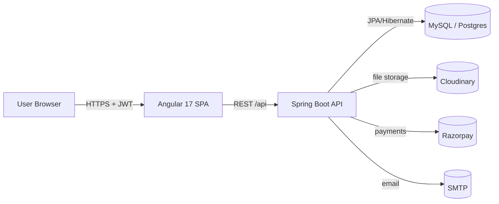
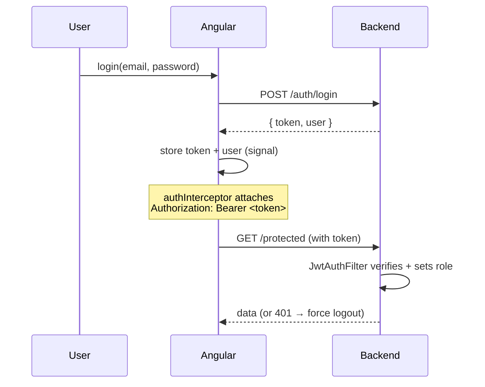
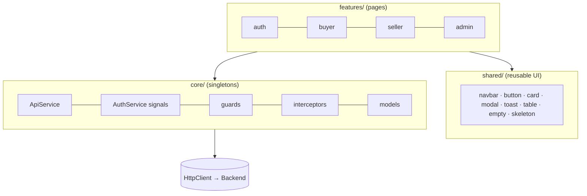
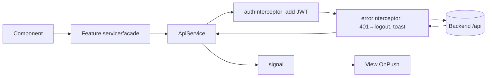
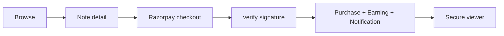
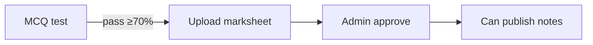
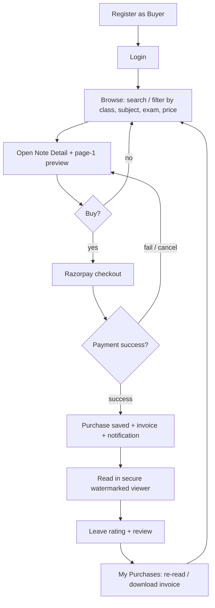
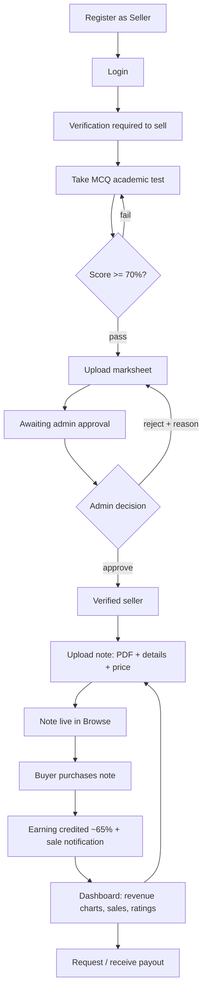
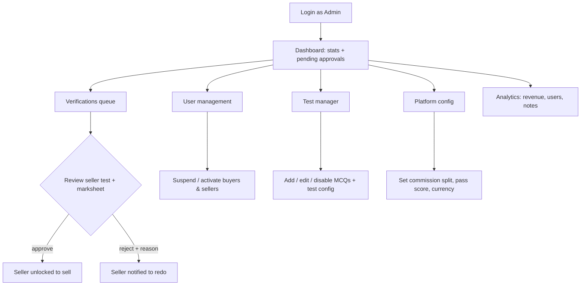
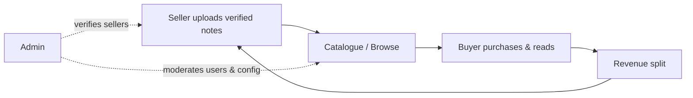

# TopNotes — Architecture (At a Glance)

Concise map of how the whole system fits together. **Frontend:** Aman · **Backend:** Akshat.

---

## 1. System overview



| Layer | Tech | Owner |
|-------|------|-------|
| Frontend | Angular 17, signals, RxJS | **Aman** |
| Backend | Spring Boot 3.2, Spring Security + JWT, JPA | **Akshat** |
| Data | MySQL (local) / Postgres (Render) | Akshat |
| Infra | Cloudinary (files), Razorpay (pay), Render (deploy) | shared |

---

## 2. Auth flow (JWT)



Roles: **ADMIN / SELLER / BUYER** — enforced by backend (`@PreAuthorize`) and mirrored on the client by route guards (UX only, not security).

---

## 3. Frontend architecture



**Data flow (one direction):** `Component → feature facade → ApiService → HttpClient → [auth + error interceptors] → API`, response → **signal** → view (`OnPush`).

**State & caching**
- UI/auth state → **signals** (`computed` for derived flags).
- Server reads → cache in a service signal / `shareReplay`; invalidate on related writes.
- Debounce search (`debounceTime`), cancel stale (`switchMap`).
- Lazy-load every feature route → small initial bundle.

---

## 4. Request lifecycle (cross-cutting)



---

## 5. Key domain flows

**Purchase**


**Seller verification**


---

## 6. End-to-end user journeys (per role)

### 6A. Buyer — register → read → review



### 6B. Seller — register → verify → sell → earn



### 6C. Admin — login → moderate → configure



### 6D. How the three roles connect (marketplace loop)



---

## 7. Backend layering (brief)

```
Controller  →  Service (interface + impl)  →  Repository  →  Entity ↔ DB
            ↘ cross-cutting: Security (JWT filter) · GlobalExceptionHandler · DTOs (request/response)
```

Money in `BigDecimal`; commission split configurable; consistent `ApiResponse<T>` envelope.

---

## 8. Repo structure

```
backend/   ← Spring Boot API (Akshat)
frontend/  ← Angular SPA (Aman) — core / shared / features
docs/      ← this file + SETUP_GUIDE, audits, checklists, design prompts
render.yaml · README.md
```

> Frontend depends on the backend's REST contract only (the `ApiResponse<T>` + DTO shapes in `core/models`). Keep that contract as the single integration point between Aman and Akshat.
